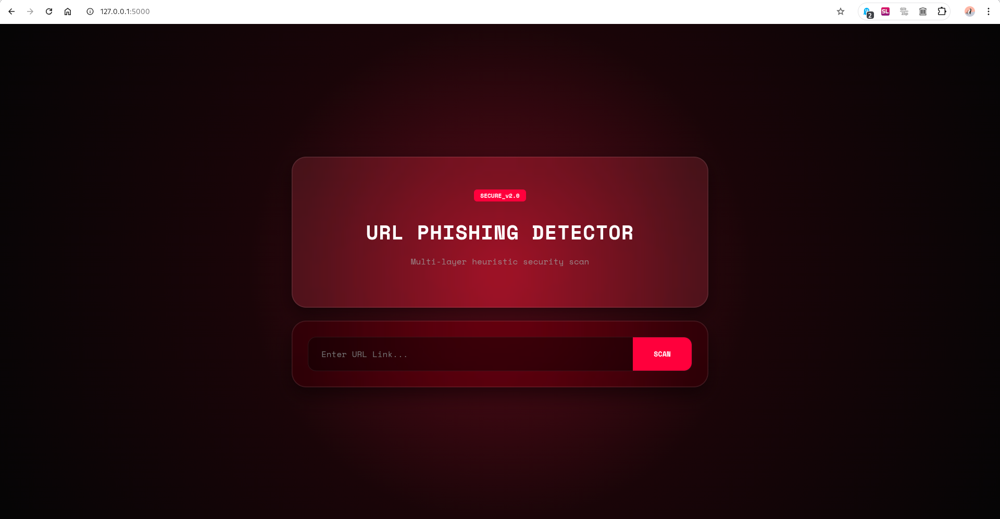

# 🛡️ Shield Scan — URL Phishing Detector

> A lightweight cybersecurity auditing tool for detecting suspicious URLs using heuristic phishing analysis.

  <strong>🔎 Analyze URLs · 🛡️ Detect Suspicious Patterns · 🔒 Learn Cybersecurity</strong>

---

## 🔎 Overview

**Shield Scan** is a lightweight Flask-based web application designed to analyze URLs for common phishing indicators.

Rather than depending exclusively on a blacklist, Shield Scan examines the structure and characteristics of a submitted URL and uses configurable heuristic rules to identify potentially suspicious patterns.

### Simple workflow

**Enter URL → Analyze → Review Result**

Shield Scan is intended for cybersecurity learning, security research, authorized testing, and local experimentation.

---

## 🖥️ Preview

  

  <em>Shield Scan — URL phishing analysis interface</em>

---

## ✨ Features

### 🛡️ Heuristic URL Analysis

Shield Scan can inspect URLs for indicators such as:

- IP-based URLs
- Abnormally long subdomains
- Suspicious URL structures
- Phishing-related keywords
- Login-related terminology
- Verification-related terminology
- Banking-related terminology
- Other configurable URL patterns

### ⚡ Lightweight

Shield Scan uses a simple Flask architecture designed to be easy to understand, run, modify, and extend.

### 🎨 Cybersecurity Interface

The interface features:

- Dark cybersecurity-inspired design
- Glassmorphism-inspired components
- High-contrast threat feedback
- Minimal input workflow
- Responsive layout
- Clear diagnostic information

### 📱 Responsive

The interface is designed to work across:

- Desktop
- Laptop
- Tablet
- Mobile browsers

---

## 🔬 How It Works

The analysis follows a simple pipeline:

**1. Enter URL**  
The user provides a URL for analysis.

**2. Normalize Input**  
The application processes the submitted URL before analysis.

**3. Analyze URL Structure**  
Shield Scan examines characteristics such as IP addresses, subdomains, keywords, and URL structure.

**4. Apply Heuristic Rules**  
Configured detection rules are applied to the URL.

**5. Generate Assessment**  
The application produces a threat-oriented assessment.

**6. Display Result**  
The result and relevant indicators are presented to the user.

> ⚠️ The result is a heuristic assessment and should not be considered definitive proof that a URL is malicious or safe.

---

## 🧪 Detection Indicators

| Indicator | Example |
|---|---|
| IP-based URL | `http://192.168.1.10/login` |
| Suspicious keywords | `verify`, `login`, `secure`, `bank` |
| Abnormal subdomain | `login.account.verify.example.com` |
| Suspicious structure | Unusual or misleading URL patterns |
| Sensitive terminology | Authentication or banking-related terms |

---

# 🚀 Installation & Setup

## 📋 Requirements

Before installing Shield Scan, make sure you have:

- **Python 3.x**
- **Git**
- A modern web browser
- Linux, Kali Linux, macOS, or Windows

### Check Python

Run `python3 --version` on Linux/macOS or `python --version` on Windows.

### Check Git

Run `git --version`.

---

## 1️⃣ Clone the Repository

Clone the project from GitHub:

`git clone https://github.com/silenTKnight-sudo506/phishing-detector.git`

Then enter the project directory:

`cd phishing-detector`

---

## 2️⃣ Create a Virtual Environment

Using a virtual environment keeps Shield Scan's Python dependencies isolated from the system Python installation.

### Linux / Kali Linux / macOS

Create the environment:

`python3 -m venv venv`

Activate it:

`source venv/bin/activate`

Your terminal should then show something similar to:

`(venv) user@machine:~/phishing-detector$`

### Windows

Create the environment:

`python -m venv venv`

Activate it:

`venv\Scripts\activate`

---

## 3️⃣ Install Dependencies

If the repository contains a `requirements.txt` file, install the dependencies with:

`pip install -r requirements.txt`

If `requirements.txt` is not present, Flask can be installed manually with:

`pip install flask`

---

## 4️⃣ Start Shield Scan

### Linux / Kali Linux / macOS

Run:

`python3 app.py`

### Windows

Run:

`python app.py`

Once the Flask server starts, Shield Scan should be available at:

`http://127.0.0.1:5000`

---

# 🧭 How to Use

## 1. Start the Application

Open a terminal inside the project directory and run:

`python3 app.py`

---

## 2. Open the Dashboard

Open your browser and visit:

**http://127.0.0.1:5000**

The Shield Scan dashboard should appear.

---

## 3. Enter a URL

Enter the URL you want to analyze in the URL input field.

For example:

`https://example.com/login`

---

## 4. Start the Scan

Click the **SCAN** button.

Shield Scan will process the URL and run its configured heuristic checks.

---

## 5. Review the Result

The application analyzes characteristics including:

- IP-based addressing
- Suspicious keywords
- Abnormal subdomains
- URL structure
- Authentication terminology
- Verification terminology
- Banking-related terminology
- Other configured indicators

The resulting assessment is then displayed by the application.

---

# 🧪 Safe Testing

For basic testing and development, use reserved example domains such as:

- `https://example.com`
- `https://example.org`
- `https://example.net`

You can also create controlled test cases locally to verify individual detection rules.

> 🔐 Only analyze URLs and systems that you are authorized to inspect.

---

# 🧰 Technology Stack

| Component | Technology |
|---|---|
| Backend | Python 3.x |
| Web Framework | Flask |
| Frontend | HTML5 |
| Styling | CSS3 |
| Client-side Logic | JavaScript |
| Development Environment | Linux / Kali Linux |

---

# 📂 Project Structure

The project is organized approximately as follows:

**phishing-detector/**
│
├── app.py
│
├── templates/
│   └── index.html
│
├── static/
│   ├── style.css
│   └── ...
│
├── demo.png
├── requirements.txt
├── LICENSE
└── README.md

---

# 🔧 Development

To set up a development environment:

`git clone https://github.com/silenTKnight-sudo506/phishing-detector.git`

`cd phishing-detector`

`python3 -m venv venv`

`source venv/bin/activate`

`pip install -r requirements.txt`

`python3 app.py`

Then open:

**http://127.0.0.1:5000**

---

# 🐛 Troubleshooting

## `python3: command not found`

On Debian/Kali-based systems, install Python with:

`sudo apt update`

`sudo apt install python3 python3-venv python3-pip`

Then verify the installation with:

`python3 --version`

---

## `No module named flask`

First activate the virtual environment:

`source venv/bin/activate`

Then install Flask:

`pip install flask`

If the project contains `requirements.txt`, it is preferable to install all dependencies with:

`pip install -r requirements.txt`

---

## `externally-managed-environment`

Some Linux distributions prevent packages from being installed directly into the system Python environment.

Create and use a virtual environment instead:

`python3 -m venv venv`

`source venv/bin/activate`

`pip install -r requirements.txt`

---

## Port 5000 is already in use

If another application is already using port `5000`, configure Flask to use another port such as `5001`.

For example, change the application configuration to use port `5001`.

Then open:

**http://127.0.0.1:5001**

---

# 🔐 Security & Privacy

Shield Scan is designed around local analysis and lightweight operation.

The project does not claim to provide complete protection against phishing, malware, fraud, or other online threats.

Heuristic analysis can produce false positives and false negatives.

Always verify suspicious URLs using additional trusted security tools and sources before making security decisions.

---

# 🔮 Future Improvements

Potential improvements include:

- [ ] More advanced URL feature extraction
- [ ] Additional phishing indicators
- [ ] Configurable detection rules
- [ ] Domain analysis
- [ ] DNS analysis
- [ ] SSL/TLS inspection
- [ ] Reputation API integration
- [ ] Scan history
- [ ] Exportable reports
- [ ] Detailed threat scoring
- [ ] Improved mobile interface
- [ ] Automated testing
- [ ] Advanced security checks
- [ ] Detailed scan reports
- [ ] Improved false-positive handling

---

# ⚠️ Disclaimer

Shield Scan is an **educational cybersecurity project** intended for:

- Cybersecurity learning
- Security research
- Authorized security testing
- Local experimentation

The heuristic assessment generated by Shield Scan is **not a guarantee** that a URL is malicious or legitimate.

Do not use this project to access, disrupt, attack, or test systems without appropriate authorization.

---

# 📜 License

Shield Scan is open source and distributed under the **MIT License**.

See [`LICENSE`](LICENSE) for the complete license text.

---

## 🛡️ Shield Scan

**Analyze suspicious URLs. Understand the indicators. Stay safer.**

 

**🐍 Python · 🌐 Flask · 🎨 HTML/CSS · 🔐 Cybersecurity**

 

Built for cybersecurity learning and research.

